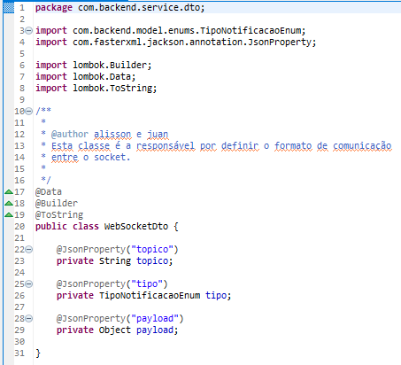

# Trabalho Final Sistemas Distribuidos
- Um sistema de um jogo parecido com jokenpô com 4 jogadores.
- Para a comunicação entre os usuários e servidor foi utilizado o protocolo HTTP para as chamadas ao servidor, trocando mensagens por JSON, e TCP para as mensagens enviadas por socket.
- Para gerenciar os dados, foi utilizado o PostgreSQL.

# Arquitetura e funcionamento do sistema
<p align="center">
    
</p>


## Tecnologias utilizadas
- Angular/Typescript: no lado do cliente.
- Java Spring Boot: no lado do servidor.
- PostgreSQL: SGBD que gerencia os dados.

## Funcionalidades 
- O jogador se inscreve em vários canais de socket:
  - Principal: ele se inscreve ao entrar no sistema, para receber informações das salas criadas.
  - Sala do jogo: ele se inscreve neste canal para trocar informações com os outros jogadores que estão na mesma sala.
- Um jogador poderá criar uma sala que comporta 4 jogadores simultâneos.
- Caso algum usuário fique offline, o sistema deverá abortar a partida.

## Interface de Serviço Remota

### Servidor
<p align="center">
    
</p>
O método 'notifyMessageChannel(@NonNull WebSocketDto message)', realiza o envio de mensagens a um canal socket expecífico.
O formato da mensagem segue o padrão abaixo.
<p align="center">
    
</p>
Onde o topico é o nome do canal socket a ser enviada a mensagem, o tipo é a definição de uma mensagem específica, onde para cada uma o valor do payload será diferente.

### Cliente
<p align="center">
    
</p>
No lado do cliente, temos mais funcionalidades: 

- 'connectSocket()': É neste metodo que realizamos a conexão do socket.
- 'createSubscription()/cancelSubscription()': É o método que irá criar/deletar uma inscrição em um dado tópico.
- 'disconnect()': É o método que irá finalizar uma conexão do socket.
- 'anyEvent()/byTopic()/onEvent()': São métodos que realizam respectivamente: dado qualquer mensagem via socket, ele irá mostrar no console do navegador; dado uma mensagem, ele filtra por topico; dado uma mensagem, ele filtra pelo tipo da mensagem.   

## Chamadas via HTTP:
`GET: localhost:8080/game-room/` </br>
Essa requisição trás todas as salas disponíveis

`POST: localhost:8080/game-room/create/` </br>
Esta requisição cria uma sala

`POST: localhost:8080/game-room/join/{id}` </br>
Esta requisição faz que um jogador entre em uma sala

`POST: localhost:8080/game-room/play/{id}` </br>
Esta requisição faz que um jogador realize uma jogada

`PUT: localhost:8080/game-room/exit/{id}` </br>
Esta requisição faz que um jogador saia de uma sala

`POST: localhost:8080/player/create` </br>
Esta requisição faz que um jogador seja criado no sistema

# Execução do sistema

Primeiro deve-se clonar o repositório

```bash
git clone https://github.com/JuanFSR/TrabalhoSD
```

## Cliente

Para rodar o cliente, deve-se primeiro instalar todas as dependências.
```bash
cd frontend/
```
```bash
npm install
```

Após isso, basta inicializar o cliente com o comando:
```bash
ng serve --open
```

## Servidor

Para rodar o servidor, deve-se primeiro instalar todas as dependências.
```bash
cd backend/
```
```bash
mvn compile
```
Após isso, basta inicializar o servidor com o comando:
```bash
mvn spring-boot:run
```
